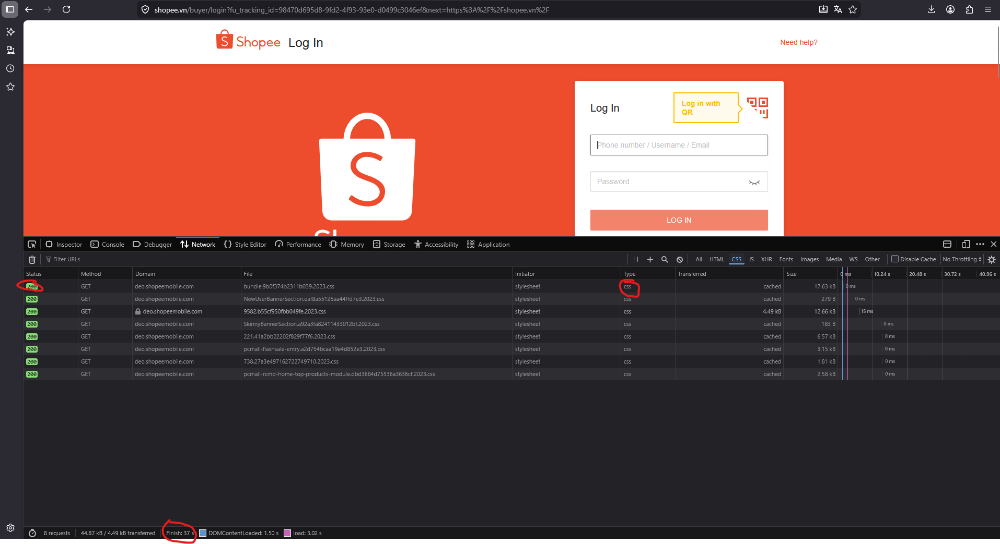

# PHIẾU BÀI TẬP 01 - ĐÁP ÁN
Tên học viên: Phạm Minh Đức
MSSV: 2251172292

---

## PHẦN A — KIỂMẾ TRA ĐỌC HIỂU

### Câu A1 (5đ) — HTTP & Browser
*Nguồn tham chiếu: tuan_1_html5/01_introduction_html_universe.md — Phần 1.1 "Architechture Client-Server" và Phần 4.3 "Developer Tools"*

**1. 5 bước xảy ra khi gõ `https://shopee.vn` vào trình duyệt và nhấn Enter:**
1. Trình duyệt (Client) gửi HTTP Request từ máy tính của bạn đi qua router WiFi.
2. Request đi qua nhà mạng (ISP) để truyền qua mạng lưới Internet (cáp quang).
3. Request đi đến được Server (Data Center) của Shopee.
4. Server của Shopee tiếp nhận và xử lý yêu cầu (lấy dữ liệu sản phẩm, banner,...).
5. Server đóng gói dữ liệu và gửi trả lại HTTP Response (bao gồm các file HTML, CSS, JS, Hình ảnh) về trình duyệt của bạn.
6. Trình duyệt khởi chạy quá trình Rendering: Parse HTML, gióng CSS và chạy JS để hiển thị giao diện phần News Feed (hay trang chủ Shopee) lên màn hình.

**2. Tab Network trong DevTools cho thấy thông tin gì?**
Tab Network trong bảng F12 (DevTools) dùng để xem và theo dõi toàn bộ các HTTP Requests và Responses được gửi đi/nhận về giữa trình duyệt và server. Bạn có thể thấy file nào đang tải, mất bao nhiêu thời gian, kích thước file, cũng như Status Code (như 200 OK hay 404 Not Found).

**3. Hình ảnh chụp Tab Network của trang Shopee:**


---

### Câu A2 (5đ) — Semantic HTML
*Nguồn tham chiếu: tuan_1_html5/04_visible_part_html.md*

**Các lỗi semantic và thẻ thay thế tương ứng:**
1. `<div class="header">`  Thay bằng thẻ: `<header>`
2. `<div class="menu">`    Thay bằng thẻ: `<nav>`
3. `<div class="main">`    Thay bằng thẻ: `<main>`
4. `<div class="footer">`  Thay bằng thẻ: `<footer>`

---

### Câu A3 (5đ) — Block vs Inline
*Nguồn tham chiếu: tuan_1_html5/04_visible_part_html.md*

**Mô tả kết quả hiển thị của đoạn HTML:**

```text
Dòng 1: Hộp 1
Dòng 2: Text A Text B
Dòng 3: Hộp 2
Dòng 4: Text C Text D (in đậm)
Dòng 5: Hộp 3
```

**Giải thích tại sao lại hiển thị như vậy:**
- Hộp (Thẻ `<div>`) là các phần tử khối (Block): Luôn tự động nhảy xuống một dòng mới khi khai báo và nó chiếm chiều ngang không gian tối đa của trang web. Do vậy các hình hộp 1,2,3 đều đứng cô đơn trên 1 dòng.
- Text (Thẻ `<span>` và `<strong>`) là phần tử nội tuyến (Inline): Chúng được phép chung sống trên cùng một mạn dòng, chỉ tốn một không gian hẹp vừa đúng bằng dòng text nó chứa. Riêng `<strong>` làm chữ in đậm giúp mạnh SEO thêm chút.

---

### Câu A4 (5đ) — Table
*Nguồn tham chiếu: tuan_1_html5/05_tables_hyperlinks.md*

**1. Phân biệt các thẻ Table:**
- `<thead>`: Dùng để chứa hàng tiêu đề của các cột (Table Head).
- `<tbody>`: Dùng để chứa toàn bộ nội dung dữ liệu của bảng (Table Body).
- `<tfoot>`: Dùng để chứa hàng tính tổng hoặc kết quả ở dưới cùng của bảng (Table Foot).

**2. Lý do KHÔNG NÊN dùng Table để tạo layout trang web:**
- **Giết chết SEO (Vi phạm ngữ nghĩa Semantic):** Bot Google sẽ hiểu nhầm web là một đống dữ liệu thống kê khô khan thay vì một trang web chuẩn có phần đầu, thân và đuôi riêng biệt.
- **Kém Responsive:** Cấu trúc cực kỳ cứng nhắc, không thể tự gập hay tự sắp xếp lại giao diện khi xem trên màn hình nhỏ (điện thoại, tablet).
- **Code rất bẩn và tổ chim:** Việc phải lồng ghép quá nhiều lớp thẻ (`<table>` tới `<tr>` tới `<td>`) khiến code trở nên dang dở, rườm rà, rất cực vất vả khi sửa lỗi.

---

### Bài B3 (15đ) — Debug HTML

**Danh sách các lỗi sai trong đoạn code gốc và cách khắc phục:**
1. Lỗi Dòng 1 `<!DOCTYPE>`: Thiếu chữ `html`. 👉 Sửa thành `<!DOCTYPE html>`.
2. Lỗi Dòng 3 `<title>Trang web`: Thiếu thẻ đóng. 👉 Sửa thành `<title>Trang web</title>`.
3. Lỗi Dòng 4 `<meta charset="utf8">`: utf8 viết thiếu dấu. 👉 Sửa thành `charset="UTF-8"`.
4. Lỗi Dòng 8 `<h1>Welcome to ShopTLU<h1>`: Thẻ đóng bị sai (thiếu dấu `/`). 👉 Sửa thành `</h1>`.
5. Lỗi Dòng 12 `<a href="home">Trang chủ<a>`: Thẻ đóng bị sai. 👉 Sửa thành `</a>`.
6. Lỗi Dòng 19 ``: Thiếu ngoặc kép ở link và thiếu thuộc tính `alt`. 👉 Sửa thành ``.
7. Lỗi Dòng 21 `<p>Giá: <b>25.990.000đ</p></b>`: Lồng thẻ chéo nhau sai logic. 👉 Sửa thành `<p>Giá: <strong>25.990.000đ</strong></p>`.
8. Lỗi Dòng 26 `<table>`: Bảng bị thiếu phân vùng Semantic. 👉 Đã bổ sung `<thead>`, `<tbody>` và đổi `<td>` tiêu đề thành `<th>`.
9. Lỗi Dòng 38 `<main>` thứ 2: Một trang web chỉ được có 1 thẻ `<main>`. Do đây là sidebar nên 👉 Sửa thành `<aside>`.
10. Lỗi Dòng 43 `<p>Copyright 2026`: Thiếu thẻ đóng. 👉 Sửa thành `</p>`.
11. Lỗi Dòng cuối: Thiếu thẻ đóng gốc `</html>` của toàn trang web.
